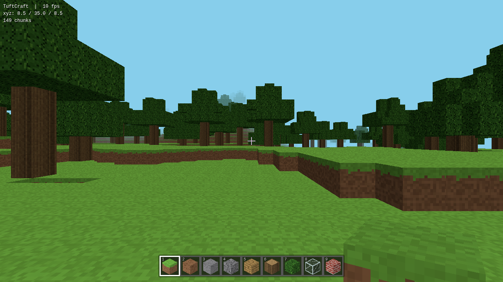

# TuftCraft ⛏️

A Minecraft clone that runs entirely in the browser — no build step, no dependencies to install, just vanilla JavaScript and Three.js.

> 🤖 Generated with [Claude Code](https://claude.com/claude-code), powered by Claude Fable 5.



## Features

- **Infinite procedural terrain** — rolling hills, mountains, beaches, lakes, snowy peaks, underground caves, and trees, generated from layered value noise with a per-world seed
- **15 block types** with procedurally generated pixel-art textures (drawn onto a canvas texture atlas at startup — no image files)
- **Mining & building** — left click to break, right click to place (hold to repeat), with a block highlight outline
- **First-person held block** with swing and walk-bob animations
- **9-slot hotbar** with fake-isometric block icons (keys 1–9 or scroll wheel)
- **Physics** — gravity, jumping, sprinting, swimming with underwater tint, AABB collision with sub-stepping to prevent tunneling
- **Fly mode** for creative building
- **World persistence** — your edits auto-save to localStorage and survive a refresh

## Controls

| Key | Action |
| --- | --- |
| W A S D | Move |
| Mouse | Look |
| Left click | Break block |
| Right click | Place block |
| Space | Jump (up in fly mode) |
| Shift | Sprint |
| 1–9 / scroll | Select block |
| F | Toggle fly mode |
| C | Descend (fly mode) |
| R | Reset world |
| Esc | Pause |

## Running it

Serve the folder with any static file server:

```sh
python3 -m http.server 8123
# then open http://localhost:8123
```

## How it works

- `main.js` is the whole engine (~1000 lines): world gen, chunk meshing, physics, input, UI
- The world is stored in 16×80×16 chunks of `Uint8Array`. Chunks within render distance are meshed with face culling (only faces exposed to air/transparent blocks are emitted), with per-face directional shading baked into vertex colors
- Block targeting uses an Amanatides–Woo voxel raycast (DDA)
- Textures are generated at startup by per-pixel painter functions with a deterministic RNG, packed into one atlas
- Terrain, caves, and tree placement are pure functions of `(x, y, z, seed)`, so chunks generate independently and tree canopies cross chunk borders correctly
